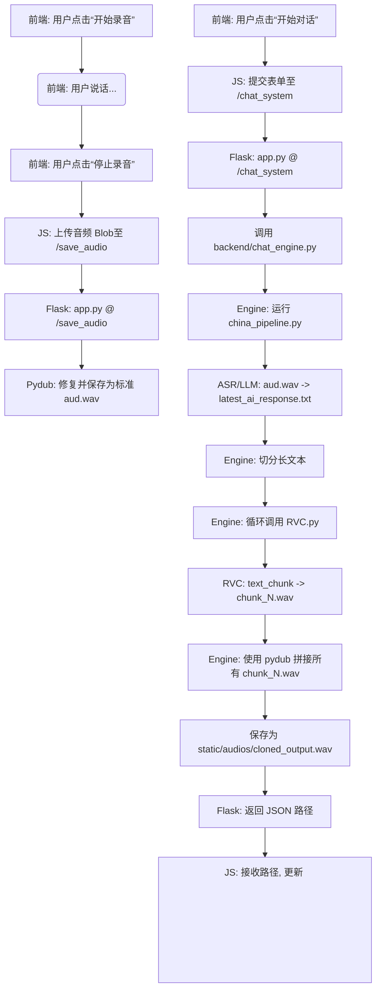

# GENEFACEPLUSPLUS 说话人脸生成对话系统

## 项目简介

本项目是一个集成了ASR（语音识别）、LLM（大语言模型）、TTS（语音合成）和RVC（语音克隆）的实时人机对话系统。

用户可以通过网页录制自己的声音，后端将自动识别语音内容，调用大模型生成回复，然后使用RVC语音克隆技术（`chatterbox-tts`）生成与特定角色（例如 `nahida.wav`）音色一致的回复音频，并将长音频拼接后返回给前端播放。

项目还包含模型训练和静态视频生成的功能。

## 核心模块

* **Flask 后端 (`app.py`):** 负责处理前端请求，提供网页服务，并作为所有后端脚本的“粘合剂”。
* **人机对话引擎 (`backend/chat_engine.py`):** 负责协调“人机对话”的完整流程，通过子进程调用ASR、LLM和RVC脚本。
* **ASR+LLM 管道 (`china_pipeline.py`):**
    * **ASR:** 使用智谱AI (`glm-asr`) 将用户录音（`aud.wav`）转换为文本。
    * **LLM:** 使用智谱AI (`glm-4-flash`) 根据ASR文本生成AI应答，并保存到 `latest_ai_response.txt`。
* **TTS+语音克隆 (`RVC.py`):**
    * **TTS:** 使用 `chatterbox-tts` 将 `latest_ai_response.txt` 中的文本转换为语音。
    * **Cloning:** 使用 `input/audio/nahida.wav` 作为参考音色，生成克隆后的音频。
* **(其他模块)**
    * **训练后端 (`backend/model_trainer.py`):** 负责调用模型执行训练任务。
    * **推理后端 (`backend/video_generator.py`):** 负责调用模型执行视频生成推理。

## 系统流程

### 1. 人机对话 (Chat System) 流程



### 2. 视频生成 (Video Generation) 流程
(来自 `app.py` 中的 `/video_generation` 路由)

```
[用户点击“生成视频”按钮]
        ↓
[前端 JS 捕获表单数据并用 fetch 发送 POST 请求]
        ↓
[Flask 路由接收 request.form]
        ↓
[调用 backend/video_generator.py 中的函数 generate_video()]
        ↓
[后端函数返回生成视频的路径]
        ↓
[Flask 把路径以 JSON 形式返回给前端]
        ↓
[前端 JS 接收到路径 → 替换 <video> 标签的 src → 自动播放视频]
```

## 环境配置与安装

### 步骤 1: 克隆项目

```bash
git clone git@github.com:prummn/genefaceplusplus_ui.git
cd genefaceplusplus_ui
```

### 步骤 2: 【关键】获取模型文件

本项目依赖的 RVC 语音克隆模型 (`models_zh`) **未包含**在 Git 仓库中（因为文件过大）。

您必须通过其他方式（例如网盘、U盘）将这些文件夹拷贝到项目根目录。

**操作：**
1.  手动**复制** `models_zh` 文件夹到项目根目录。


项目结构应如下所示：
```
/genefaceplusplus_ui/
|-- app.py
|-- china_pipeline.py
|-- RVC.py
|-- requirements.txt
|-- README.md
|-- backend/
|-- input/
|   |-- audio/              (参考音色文件目录)
|       |-- nahida.wav
|       |-- zhb.wav
|   |-- text/               (RVC.py测试时的输入文字)
|       |-- nahida.txt
|       |-- text.txt
|-- models_zh/          <-- (需手动复制, 5个G左右)
|-- output/             
|   |-- cloned_nahida.wav   (RVC.py测试时的输出音频)
|-- static/
|   |-- audio/              
|       |-- cloned_output.wav  (服务器开启后RVC.py的输出音频)
|-- templates/
|-- SyncTalk/
|   |-- audio/              (网页录音保存目录，服务器开启后china_pipeline.py的输入音频路径)
|-- latest_ai_response.txt  (AI应答文字，服务器开启后RVC.py的输入文字)
|-- conversation_log.txt    (AI对话历史)
```

### 步骤 3: 创建 Conda 环境

`requirements.txt` 文件显示本项目在 `Python 3.9` 上开发。我们强烈建议使用 Conda 来创建一个隔离的纯净环境。

```bash
# 1. 创建一个名为 geneface_env 的新环境
conda create -n geneface_env python=3.9 -y

# 2. 激活环境
conda activate geneface_env
```

### 步骤 4: 【关键】安装依赖

**A. 安装 ffmpeg (系统依赖)**
`pydub` (修复音频) 和 `librosa` (调速) 都需要 `ffmpeg`。

```bash
# (在 geneface_env 环境中)
conda install -c conda-forge ffmpeg
```

**B. 安装 PyTorch**
`requirements.txt` 包含了特定 CUDA 版本的 `torch` 包。

```bash
# (在 geneface_env 环境中)
pip install torch torchaudio torchvision --index-url [https://download.pytorch.org/whl/cu121](https://download.pytorch.org/whl/cu126)
```

**C. 安装其余依赖**
现在，安装 `requirements.txt` 中剩余的所有包。

```bash
# (在 geneface_env 环境中)
# 注意：如果 requirements.txt 中包含 --index-url，它会使用清华源
pip install -r requirements.txt
```

### 步骤 5: 【关键】测试 `RVC.py` 脚本

单独运行 `RVC.py` 文件，测试其能否在该环境下正确运行。
```
# 输入音频、文字和输出音频路径已在脚本中指定
python RVC.py
```


## 运行项目

1.  **激活 Conda 环境：**
    ```bash
    conda activate geneface_env
    ```

2.  **启动 Flask 服务器：**
    ```bash
    python app.py
    ```
    您将看到服务器在 `http://127.0.0.1:5000` 上运行。

3.  **访问应用：**
    打开浏览器并访问 `http://127.0.0.1:5000`。

4.  **使用人机对话功能：**
    a.  点击 "人机对话" 按钮。
    b.  点击 "开始录音"，说话，然后点击 "停止录音"。
    c.  点击 "🎤 开始对话" 按钮。
    d.  等待后端处理（ASR -> LLM -> RVC -> 拼接）。
    e.  处理完成后，音频将自动在网页上播放。